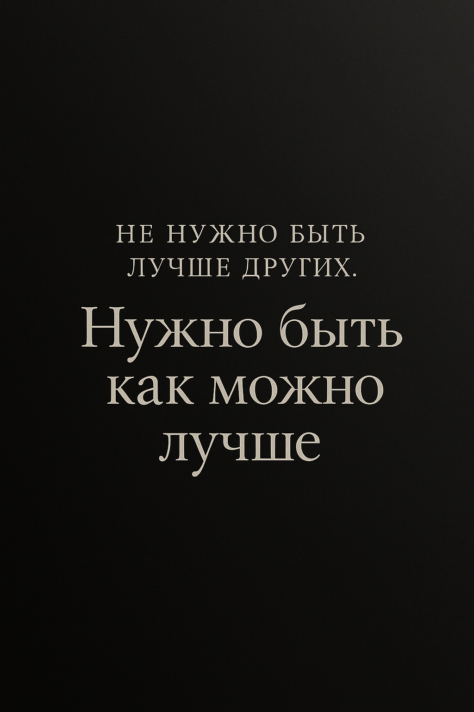

# Мышление Миллиардера.

#### **Каково же оно — мышление миллиардера?**

## ♾ **Мышление → Мысли → Действия → Результат.**

Всё. На этом можно было бы остановиться, но давай углубимся в первый элемент цепочки — _мышление_. Именно оно определяет всё последующее. Это фундамент.

💲В основе любого настоящего успеха лежит не просто «навык», а **определённый тип мышления**. Навыки важны — безусловно. Но навык без мышления подобен топору в руках человека, который не знает, зачем он ему. Самый частый вопрос: _что важнее — мышление или навык?_ Ответ односторонний — ошибочен. Это не либо-либо. Это **Инь и Ян**. Но последовательность имеет значение: **сначала мышление, потом навык.** Потому что навык — это инструмент. А мышление — это цель, карта, метод и воля.

> ♾ Мысли определяют действия. Действия создают результат. А мысли, в свою очередь, исходят из мышления. Поэтому если ты хочешь изменить свою жизнь — **измени мышление**, не просто действия. Именно оно запускает всё.

***

#### **Почему одни добиваются, а другие — нет?**

Возьмём простой пример. Два школьника. Оба учатся в одной школе, посещают одни и те же уроки. Проходят один и тот же материал. Проходит время — один становится миллиардером, другой — бедным. Почему?

Потому что **успех не даётся тем, кто просто «знает»**. Его получают те, у кого **есть фундаментальная картина мира**. Твёрдое основание. Стратегия. А большинство строят на песке: учат навыки без мышления, строят дом без фундамента, пускаются в путь без направления.


**Это и есть главная ошибка**. Люди учатся продавать, вести блог, программировать, инвестировать — не понимая, _кто они_, _зачем им это_, _как они принимают решения_, _что на самом деле хотят построить_. Они ставят телегу впереди лошади.


Многие не способны досмотреть двухчасовое видео. Прочитать 20 страниц книги. Слушать другого, не отвлекаясь. Это не «проблема с вниманием». Это _отражение уровня мышления_. Мир, в котором побеждают те, кто **может концентрироваться и мыслить глубоко**.

***

#### **Из чего же состоит мышление миллиардера?**

Здесь — **5 ключевых этапов**. Простых по формулировке. Но не по осознанию. Пройти их — значит **собрать себя как систему**. Не «сверху вниз», а «изнутри наружу».

**1. Ментальная осознанность**

Это отправная точка. Она включает в себя три элемента:

* **Самоосознание** — умение выйти за рамки автоматических реакций и наблюдать за собой. _Не сливаться со своими мыслями, а смотреть на них со стороны._
* **Идентичность** — _кем ты себя считаешь?_ И кем являешься **на самом деле?** Твоя идентичность — это не просто ярлык. Это фильтр, через который ты воспринимаешь возможности и угрозы. Как говорил Михаил Фридман: _«Сначала нужно честно признаться самому себе, кем ты являешься на самом деле»_
* **Система убеждений** — всё, во что ты веришь. Что работа должна быть тяжёлой. Что богатые — нечестные. Что деньги портят. Что ты не из тех, кто может. Эти идеи незаметны, но именно они управляют твоими решениями. Их нужно осознать — и переписать.

***

**2. Ментальное восприятие**

Это система приоритетов. Умение **видеть, что важно, а что нет**. Что производит ценность, а что её съедает. Что укрепляет твоё будущее, а что разрушает. Твоя ментальная модель — это внутренняя версия **матрицы Эйзенхауэра**, но не на бумаге, а встроенная в восприятие. **Чёткое мышление = Чёткая жизнь.**

Если ты не различаешь важное и срочное — ты будешь занят всегда, но без прогресса.\
Если ты не отличаешь глубину от поверхностного — ты будешь метаться.\
Если ты не понимаешь, что стратегично, а что — реакция, ты будешь жить чужой повесткой.

<figure><figcaption></figcaption></figure>

> **Например, тебе нужно сделать проект.** Ты знаешь, что это займет всего 3 часа непрерывной работы. Но перед этим решаешь полистать TikTok пару минут: нет ментального восприятия.

**Это был микроуровень.** На макроуровне это относится к выбору: «жить сейчас так, как никто не хочет, чтобы потом жить так, как никто не может». Люди выбирают прожигать своё здоровье, тусоваться, бездумно «убивать» время вместо того, чтобы учиться, работать, улучшать здоровье, прокачивать интеллект.

**Также это про умение делегировать.** Это про то, как вы справляетесь со стрессом и решаете проблемы. Здесь также pattern recognition.

## Бизнес-принципы.

🧠 Это твои мысли, принципы, убеждения о _ведении_ бизнеса.

Например, один из моих принципов: **клиент - центр бизнеса.** Если я сделаю клиента счастливым, я увеличу свою колонку активов. Другой пример: **денежный поток**(реинвестирование). Еще один: сберегай и **инвестируй 10%** своих доходов. Их множество.

## Бизнес-дисциплины.

Цель нашей школьной системы - создать работника, который знает только одну дисциплину, например, врача, копирайтера, учителя.

> А что делают миллиардеры?

Они хорошо разбираются в множестве дисциплин и нанимают тех, кто блестяще владеет только одной. Таким образом, миллиардер _хорошо разбирается_ в переговорах, продажах, маркетинге, инвестициях, дизайне, размещении продукта, лидерстве, копирайтинге и т.д. При этом он не рассеивает своё внимание; его навыки как бы наслаиваются друг на друга, тем самым повышая ценность, которую он может предоставить рынку. Он не лучший работник. **Он лучший лидер, который нанимает лучших работников.**

## Навыки.

И каждая дисциплина дает знание о множестве навыков, особенно тех, которые преподаются в школьных системах. Люди учатся копирайтингу, а миллиардер изучил его как один из множества навыков из множества дисциплин.


Сегодня люди учат только один навык _(если вообще учат)._


**Если вы хотите стать Успешным,** то сначала вам нужно выстроить Ментальную осознанность и восприятие. Понять основные Бизнес-Принципы(буквально купив 3-5 книг). Начать изучать конкретные Бизнес-Дисциплины, параллельно развивая в себе десятки Навыков. Вместо того, чтобы сразу, без фундамента начать изучать один единственный навык.

## Мысли. Системно.

❗️Основная проблема заключается в том, что люди не хотят принимать одну вещь: усилия ≤ результаты, вложенное ≤ полученное.

#### Рассмотрим одну схему:

<figure><figcaption></figcaption></figure>

**Input** - наши усилия, наши вложения, наше время, наша энергия.

**Process** - сам акт взаимодействия с затратами(усилиями).

**Output** - результат, вывод(то, что мы получаем).

**Feedback** - обратная связь по завершении этапа Process. Здесь очень тесная связь с методикой «ГАД» - Гипотеза/Анализ/Действие.

**Этап Анализ = Feedback.** Стоит помнить, что нам не нужна чрезмерная рефлексия, иначе она затмит наши действия и станет на первое место. Благодаря этапу Feedback мы можем корректировать наш Input(усилия, вложения). То есть если ты не зарабатываешь сейчас желаемую сумму(у тебя нет нужного output), значит твой Input - _недостаточен_.

**Environment** - окружающая среда. То, что влияет на наш Input. Как в положительную, так и в отрицательную сторону. То есть окружающей средой могут стать **книги**, которые дают вам знания(Input) + вы применяете знания на практике(process). Но также вашей окружающей средой могут стать **Тусовки**, Скроллинг Тик-Токов, Компьютерные Игры, Порнография и др. - при таком Input я считаю Результат(Output) понятен.

> Просто следуйте этой формуле и оценивайте каждое своё действия через Ментальную Осознанность(см. выше).

📝 Распечатайте себе эту табличку и повесьте на стену, чтобы она всегда у вас была перед глазами. И в моменты, когда захочется бросить это всё и сдаться _- взять себя в руки и работать дальше._

_Подпишите себе заодно что-то вдохновляющее. Уж поверьте мне, в моменты отчаяния и бессилия это точно пригодится.._

## Р/РС Баланс.

❗️Важнейшая парадигма, которая открывает вам глаза на то, как в этом мире всё взаимосвязано. Она подскажет, какие действия нужно делать, чтобы **ДОБИВАТЬСЯ** своих целей.

### Чтобы вы поняли, начнём с притчи:

<mark style="background-color:blue;">Жили - были муж и жена, которые зарабатывали на жизнь тем, что разводили гусей и продавали гусиные яйца на рынке. Жили совсем не богато, но не голодали и на жизнь не жаловались.</mark>

<mark style="background-color:blue;">Однажды к ним во двор забрела какая-то гусыня. На другой день хозяева с удивлением обнаружили новое блестящее яйцо из чистого золота. И на следующий день гусыня снова снесла золотое яйцо. Так продолжала она нести по одному золотому яйцу каждый Божий день.</mark>

<mark style="background-color:blue;">Супруги продавали яйца по очень хорошей цене и вскоре разбогатели так, как и мечтать не смели никогда.</mark>

<mark style="background-color:blue;">Однако вскоре стали они жаловаться на то, что несет гусыня каждый день всего лишь по одному золотому яйцу.</mark>

<mark style="background-color:blue;">И сказал как-то фермер жене:</mark>

<mark style="background-color:blue;">— Гусыня-то наша наполнена золотом! И зачем мы ждем каждый день, чтобы она снесла всего лишь одно яйцо?</mark>

<mark style="background-color:blue;">— Если заколем её, то возьмём всё золото сразу, – согласилась жена.</mark>

<mark style="background-color:blue;">Сказано, сделано. И закололи гусыню.</mark>

<mark style="background-color:blue;">Каково же было их изумление, когда они увидели, что внутри - это самая обыкновенная гусыня. Но больше уже некому было нести для них золотые яйца.</mark>

**Р - результат.** (Золотые яйца). **РС - ресурсы и средства.** (Гусыня).

В жизни нужно уделять внимание и тому, и другому. То есть ваш результат напрямую зависит от средств. Это пример тому, когда люди, заработав денег, перестают следить за финансами, напокупают дорогих вещей, убирают фокус с того, что сделало их богатыми и уходят в бедность **- забыли о гусыне.** Или наоборот, только и делают, что экономят, в итоге увольняют с работы за нестиранный вид, на котором экономили **- забыли о яйцах.**

## **Три типа ресурсов: физические, финансовые, человеческие**

Мышление миллиардера начинается с понимания: **всё в жизни требует баланса между результатом и источником этого результата.** Именно этот принцип лежит в основе модели Р/РС — результат и ресурс, или, говоря языком притчи, _золотые яйца и гусыня_. Нарушаешь баланс — и теряешь всё.

В реальной жизни это проявляется во всём. Прежде всего — в трёх _ключевых_ типах ресурсов:

**1. Физические ресурсы**

Мы разрушаем физические ресурсы тогда, когда стремимся к моментальной отдаче. Это может быть всё, чем мы пользуемся ежедневно: техника, транспорт и — прежде всего — _собственное тело_.\
Если ты годами не обслуживаешь автомобиль — он ломается. Если ты изнашиваешь себя без восстановления — твоя работоспособность обрушится. Это и есть перекос в сторону результата: получить максимум здесь и сейчас, не думая о последствиях.

Тело, как и машина, как и оборудование — требует не только использования, но и вложений: сна, ухода, восстановления, апгрейда. Это не слабость — это **стратегия выживания на длинной дистанции**.

**2. Финансовые ресурсы**

Ты не можешь получать финансовый результат, если у тебя нет системы, которая этот результат производит. Навык делать деньги — и есть твой _ресурс_.\
Если ты не развиваешь себя, не инвестируешь в знания, не строишь активы — не будет и результата. **Нет PC — не будет P.** А значит:\
– зависимость от начальника,\
– кредитная нагрузка,\
– отсутствие свободы.

Это пример тому, когда люди, заработав денег, перестают следить за финансами, напокупают дорогих вещей, убирают фокус с того, что сделало их богатыми и уходят в бедность _**- забыли о гусыне.**_ Или наоборот, только и делают, что экономят, в итоге увольняют с работы за нестиранный вид, на котором экономили _**- забыли о яйцах.**_

#### 3.Человеческие.

Два человека, находящихся в паре, начинают печься о золотых яйцах - P(манипуляция друг другом ради собственных потребностей, доказательства ошибок партнера, непринятие неправоты) больше, чем о друг друге - PC(перестают проявлять доброту, знаки внимания, любовь, красоту, нежность, непосредственность). **Как итог: разрушенные отношения.** И никакие разговоры о "работе над собой" не помогут.

Это касается и родителей с детьми. В детстве они могут пренебречь **PC**:

* **Недодать внимания.** Недолюбить. Не выслушать. Не понять. Не объяснить.
* **Разбаловать.** Чрезмерно.

В итоге либо авторитаризм, либо вседозволенность. Из крайности в крайность - _**не даст результата.**_ Нужна мера. Нужен баланс.

## Эффективность заключается в равновесии(всё в меру).

**Перекос в сторону Р** приводит к подрыву здоровья, износу техники, уменьшению банковского счёта и разрыву отношений.

**Перекос в сторону РС** - то же самое, что бегать 4 часа в день и хвастаться, что это продлевает жизнь, хотя из 16 часов своей жизни ты тратишь 4 на бег.. Этот баланс обеспечивает равновесие между долгосрочным и краткосрочным: желание видеть комнату убранной и создание отношений с ребёнком; желание заработать $1.000.000 и баланс между работой и отдыхом; желание счастливой семьи и умение слышать.

## Запоминанием правила:

* Если ты фокусируешься на входе — на ресурсе (PC), результат (P) приходит сам собой.
* Если ты фокусируешься только на результате (P), не заботясь о ресурсе (PC), ничего не происходит.
* Что вложишь — то и получишь. (_Мусор на входе — мусор на выходе._)

## Лодка и ТО.

Представим, что у нас есть лодка и нам нужно, чтобы она плыла как можно быстрее(ведь именно так мы сможем победить).

#### Что нам позволит это сделать?

1. Действия, которые сделают нашу лодку _быстрее._
2. Техническое _обслуживание_ лодки.

Сейчас мы с вами тратим просто уйму времени на техническое обслуживание лодки. Мы тратим время на те вещи, которые **не делают нашу лодку быстрее.** Опасность второго типа работы заключается в том, что она выглядит, как работа, ощущается, как работа и это та вещь, _без которой нельзя обойтись._ Но вот когда мы делаем эту работу, мы чувствуем прогресс, мы чувствуем, что движемся вперёд, приближаемся к победе.

**Реальность:** мы не двигаемся никуда. Мы стоим на месте. Мы просто поддерживаем состояние лодки.

А как в мире происходит? Если ты не приспосабливаешься, если ты не изменяешься - ты выбываешь. Это не Я придумал, это закон природы. Вы должны быть уверены, что каждый день Вы делаете те вещи, которые делают вашу лодку _**быстрее и быстрее.**_


Важно: не нужно стараться быть быстрее соперников, нужно стараться быть _как можно быстрее._


**Учитель преподавал уроки своему ученику по скачкам.** И он решил, что уже готов сразиться с учителем. В итоге они устроили гонку и ученик проиграл:

— Учитель, вы же сказали, что обучили меня всему, что знаете, но выиграли - значит вы соврали!

— Что вы! Я передал, все, что знал. Просто Вы не смогли правильно воспользоваться знаниями.

_(Они у них одни и те же, только у учителя мудрость есть(опыт). Он знает, как их применять.)_

— Вы все свои помыслы направили лишь на то, чтобы постоянно быть впереди меня. Разве можно было в этих условиях думать ещё и о том, как править собственной лошадью? _(а именно правильное управление лошадью ведет к победе, и как следствие, обгону противника)._

— В этом причина того, что вы проиграли.

Притча показывает, что нужно быт сфокусированным именно на том, что делает твою _лодку быстрее._

**Нередкая помеха нашему движению вперёд** - наше стремление не двигаться как можно быстрее, а двигаться быстрее других. Кажется, что это одно и то же, но именно здесь часто прячутся 2%, которые отличают поражение от победы.

<figure><figcaption></figcaption></figure>

Зарисовывайте себе эту надпись на стену, поставьте на рабочий стол — куда угодно, главное пересекаться с ней глазами. **Это надпись победителя.** Следование ей поможет достичь успехов.

#### Практические шаги, как решать, что делает лодку быстрее, а что является ТО:

Появляется проблема/задача, которую нужно решить.

1. Попробуйте от неё избавиться. Задайте себе вопрос: _эта вещь делает мою лодку быстрее?_ Будьте честны.
2. **Если получилось - Решено.** Если нельзя никак избавиться, то задайте второй вопрос: _можно ли эту вещь как-то автоматизировать?_ Сейчас есть AI, пользуйтесь ресурсами.
3. Если получилось - Решено. Если нельзя никак автоматизировать, то нужно найти человека, который будет решать эту проблему.
4. Находите человека, кому делегируете работу:

* **Вариант 1. Делегирование исполнения**. Далее Вы создаёте скрипт для решения этой проблемы. Детально объясняете, как и что делать. Пойди туда, сделай так, принеси мне результат. Проблема решена.
* **Вариант 2. Делегирование руководства.** Фокус на результате, а не на методах. Основные принципы:

1. Желаемый результат. Акцент на ЧТО, а не на КАК.
2. Правила. Укажите на возможные трудности, проблемы, скажите чего НЕ делать.
3. Ресурсы. Определить ресурсы для решения проблемы.
4. Отчётность. Установить стандарты и критерии исполнения при оценки результатов.
5. Последствия. Здесь Стимулы по Принципу Агрессии: как положительные, так и негативные.

Тот, кому делегировали руководство, становится боссом, а к достижению оговоренных желаемых результатов его направляет собственная совесть.

Сегодня у тебя есть огромная фора, которой не было у предпринимателей даже пять лет назад: **ты можешь нанять работника, который умеет всё.** Пишет, считает, анализирует, проектирует, предлагает, рисует, оформляет. Он не устаёт, не спорит, не требует отпуск. И он доступен тебе прямо сейчас — это **нейросети.**

Если ты по-настоящему хочешь ускорить свою «лодку» — научись использовать эти инструменты. Не поверхностно, не поиграться, а встроить их в свою систему. Сегодня искусственный интеллект может закрывать десятки задач: от черновиков и структуры до маркетинговых идей, графики, расчётов и автоматизаций. Это не замена человеку, но **это первый человек, которого ты можешь нанять бесплатно — и он уже будет полезен.**

📌 И если ты до сих пор всё держишь в голове или решаешь вручную то, что можно отдать на автомат, — ты не в мышлении миллиардера.\
Миллиардер — это не тот, кто делает всё сам. Это тот, кто **находит способ**, чтобы работа была сделана **без него.**

Не стоит забывать, что **ТО очень важно.** Без него лодка просто плыть не будет. Без ТО невозможно думать о том, как сделать лодку быстрее - она развалится. Просто ваш фокус должен быть направлен на то, _как сделать лодку быстрее, а не как её обслуживать._

## Трава не зеленее у других.

Какова система у прибыльного дела? Сначала нужно чему-то обучиться, что-то нужно знать, а затем это дело приносит прибыль.

#### Обучиться -> (время) -> деньги.

Но в современном мире мы смотрим на эту схему, и понимаем, что нам не хочется тратить годы на упорный труд, сидеть без результата, чтобы потом, и то, **негарантированный** результат пришел к нам.

**Что мы делаем?** Открываем соц. сети и видим десятки «Успешных» людей, которые выставляют свою «Успешную» жизнь напоказ. Вы видите, что человек - **успешный**(в вашем субъективном понимании) и думаете: ага, буду заниматься тем, чем он.

Проходит небольшой промежуток времени, на мотивации и энтузиазме вы проделывали какие-то действия, даже может заработали что-то, но опять **«что-то не так»**. Теперь у вас в ленте есть другой Вася Залупкин, который делает миллионы рублей в месяц на криптовалюте. Вы бросаете свое дело, потому что _«вот оно, вот чем Я должен заниматься»._

**Снова какие-то действия, снова нет результатов.** Появляется злость и ненависть к людям в интернете, все резко становятся в вашем сознании _инфоцыганами_. Включается бедное мышление. В итоге: **нет ни денег, ни машины мечты, ни девушки мечты, не жизни мечты.**

## Какая была ошибка? Человек метался.

Сейчас, благодаря соц. сетям мы видим траву каждого. Мы видим, какая она у всех зелена, красивая, подстриженная. Но мы не видим того количества времени, энергии, средств, усилий, попыток и неудач, потраченных на то, чтобы получить эту зеленую траву.

#### Мы видим, как всё легко. Но на самом деле, оно не так.

🍀 Трава не зеленее на другой стороне. Трава зеленее там, где мы её поливаем.

Я даже напишу это ещё раз:

**Трава не зеленее у других. Трава зеленее там, где мы её поливаем.**

Чтобы получить эту зеленую траву, нужно выбрать дело, в которое погрузимся с головой, в котором мы изучим почти всё, что можно. Будем пробовать, ошибаться и делать выводы по **«Методике Для Развития»**. И только через время, набравшись опыта у нас начнет что-то получаться. Это закон.

Ты должен выбрать дело, посадить семена и ухаживать за ними, не переключаясь ни на какие другие дела. _Просто ухаживать несмотря на то, что не получается._ Вы не поливали свою траву годами, но хотите, чтобы у вас она была самая зеленая. Так не бывает. Это закон.

**На вашем пути будут соблазны:** переключиться со своего дела. Вы будете видеть эти зеленые вспышки, как другие делают быстрые и лёгкие деньги. Сейчас, например, это Mem-coins, Тапалки и др. Люди продают все своё имущество, вкладываются и прогорают, потому что увидели, что какой-то Петя Пупкин сделали $3.000.000 на каком-то Дрист Коине. Именно на таких и делают эти деньги. Да, на этом можно заработать, но если относиться к этому, как забаве: выделить деньги, с которыми ты уже в голове расстался. Их потеря никак не повлияет на твоё состояние, а прибыль - будет приятным бонусом. Здесь нужнó хладнокровие.


Даже если влиятельные люди начали рекламировать или участвовать в этих зеленых свечах - **это не значит,** что и вы должны.


Самые успешные люди просто выбрали своё дело и занимались им. У них не было других отвлечений и переключений. Они просто делали. Дисциплинированно делали.

Джефф Безос, Криштиано Роналду, Майкл Джордан, Уоррен Баффет, Джим Керри, Михаил Фридман, Оскар Хартманн, Арнольд Шварценеггер, Сильвестр Сталлоне - **Вы видите, что это не только про бизнес? В любой сфере жизни: нужно время и труд.**

#### Трава не зеленее у других. Трава зеленее там, где её поливают.

## Перспектива.

Важно обучаться тем навыкам, на которые будет спрос всегда. Наш мир меняется невероятными темпами, вместе с трендами. Но есть нарративы, которые будут актуальны **всегда**(пока что они всегда были актуальны):

1. **Умение предоставлять ценность.** Вы должны уметь решать проблемы других людей, вы должны уметь удовлетворять их потребности.
2. **Умение продавать.** Если вы лучше всех в мире пишете код, но никто об этом не знает - _вы не пишете лучший код в мире._ Вам нужно уметь создавать мнение, что именно ваш продукт, что именно ваша услуга нужна покупателю. Навык убеждения/управления был актуален всегда. Люди покупают тогда, когда считают, что товар/оказанная услуга им обойдётся ниже цены, которую они готовы заплатить(или =цене). Продавцы продают товар/оказывают услугу по такой цене, что она выходит чуть больше, чем было затрачено на изготовление. И покупатель, и продавец видят выгоду. Это и есть рынок. **Это и есть реальность.**

## Наставление от Гранта Кардона.

#### -1ый Шаг к Богатству.

Ты должен _устать_ сидеть без денег, ты должен _устать_ быть неудачником.

**Тебе не нужно опускаться на самое дно.** Потому что, достигнув дна, ты можешь открыть новое, более глубокое. А затем новое, еще более глубокое. Я имею в виду, просто взгляни на океан: дно уходит все глубже, глубже и глубже. И у дна есть своя сила. И оно чертовски сильное, так что, если ты недостаточно силен, оно может не позволить тебе выбраться из него, и ты останешься неудачником.

Ты должен _устать_.

#### Про Свободное Время.

Свободное время на самом деле - это наркотик. Не принимай наркотики, не смотри порно, не общайся с с\*чками и т.д.


Ты молодой парень, который пытается разбогатеть? Оставь женщин в покое. Оставь все это дерьмо на потом.


**Разбогатей.** Каждая захочет быть с тобой. Каждый человек захочет быть с тобой, потому что ты будешь излучать эту энергию успеха, богатства и изобилия.

Чисто питайся, следи за собой и _не трать время зря._ В свободном времени обитают наркотики. В свободном время живут депрессия и дьявол.

Сегодня тебе уже нужно подготовиться к тому, **что завтра ты проснешься пораньше,** пойдешь на тренировку, будешь работать, пойдешь завтракать со своими приятелями, которые тоже не любят все это дерьмо вроде наркотиков, клубов и с\*чек.

> Если вам становится скучно, вы создаете проблемы себе и сподвигаете других людей на идиотские поступки.

## Почему Важна Осознанность?

Вы не можете решить свои проблемы в своей жизни с тем же мышлением, которое создало эти проблемы. (Посмотри схему в самом верху)

**Вам нужно:**

1\. Осознать это.(для этого Вы и читаете это)

2\. Принять это в своей картине мира.

3\. Не винить себя за это. Так должно было произойти.

4\. Начать, представляя конечную цель. Определите свой неудовлетворительный пункт B и удовлетворительный пункт А.

5\. **Если вы определили, что вы хотите что-то иметь, то мы возвращаемся в Гайд Дробление, чтобы осознать:** чтобы что-то иметь, надо что-то делать. То есть вы должны начать делать что-то другое, что-то, что принесет вам желаемый результат.

6\. Если желание, то исполнение не замедлит.
