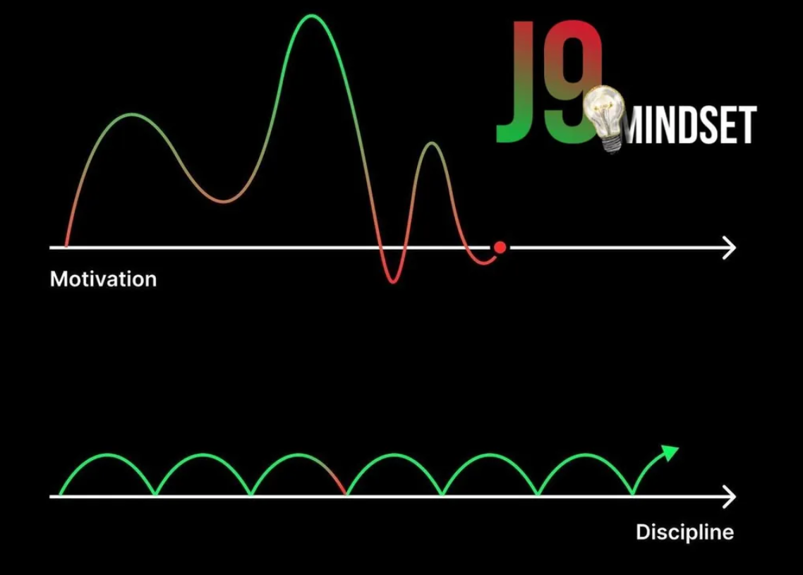

# Дисциплина.

## **Дисциплина >>> Мотивация.**

_Успех — это не озарение. Это привычка._\
Каждое твое усилие, каждое движение вперёд, сделанное не по настроению, а по решению — это кирпич в фундамент. В этом и есть сила дисциплины: _ты делаешь, даже когда не хочешь_.

**А что такое мотивация?** Это вспышка. Вдохновение. Ветер, который подул — и так же исчез.\
Ты сгораешь от желания что-то изменить, запускаешь новый проект, идёшь в зал, читаешь книги. Проходит два дня — и вот ты уже снова в телефоне, снова в кровати. Потому что **мотивация зависит от эмоций**, а эмоции — штука переменчивая.

&#x20;Мотивация говорит: «Я хочу».\
Дисциплина отвечает: «А я делаю».

***

## **Системность важнее вдохновения.**

Системный человек — это тот, кто _работает по плану_, а не по порыву.\
Он как часовой механизм: чёткий, точный, надёжный.\
Он _выходит на пробежку не потому что хочется, а потому что в календаре стоит метка_. Он не пропускает тренировку, потому что сегодня «низкий ресурс». Он просто делает.\
А потом проходит время — и он уже впереди всех.

🧠 Парадокс: _именно системность возвращает мотивацию_. Именно из ежедневных действий рождается уверенность, желание, энергия. Сначала ты двигаешься через «не хочу», потом организм сам даёт тебе ресурс — потому что он видит: ты серьёзно.

***

## **Привычка делать, когда «не хочу».**

Сила воли — это не «стиснуть зубы и страдать».\
Это — _умение раз за разом выбирать правильное, а не лёгкое_.\
Ты можешь не хотеть вставать рано — но встал.\
Ты можешь не хотеть читать — но прочёл хотя бы 5 страниц.\
Ты можешь не хотеть делать отчёт — но сел и сделал.

_Вот в этом простом «не хочу, но делаю» — рождается настоящая дисциплина._

***

## **Простая формула:**

> **Мотивация вдохновляет.**\
> **Дисциплина формирует.**\
> **Системность продвигает.**\
> **А привычки закрепляют.**

Если ты ищешь силу — строй систему.\
Если ты хочешь расти — действуй через «не хочу».\
Если ты хочешь быть лучшим — дисциплина станет твоим щитом.

Оглянись вокруг.\
Все, кто шёл по зову эмоций — уже где-то свернули.\
Ты хочешь быть как они? Нет.\
Значит — вставай. Работай. Двигайся.\
**Каждый день. Без исключений.**

<figure><figcaption></figcaption></figure>
