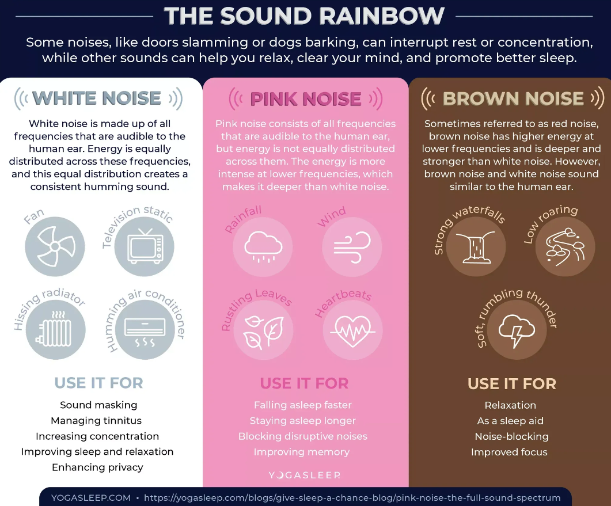

# Коричневый Шум.

## Как звук можно покрасить?

В мире звуковых фонов существует такое понятие, как **коричневый** шум - звук, который содержит все частоты в более высокой интенсивности на более низких частотах. Этот звуковой фон, часто описываемый как звук потока воды или шум водопада, может иметь удивительные эффекты на нашу _продуктивность_ и фокус.

#### Да бред какой-то..

* **Повышение продуктивности:** Создание подходящей атмосферы с помощью **коричневого** шума может увеличить вашу продуктивность на работе или в учебе.
* **Снижение стресса:** Успокаивающий шум потока воды может помочь справиться со стрессом и тревогой, повышая ваше **эмоциональное** благополучие.
* **Создание комфортного пространства:** Коричневый шум может сделать ваше **рабочее** место или пространство для отдыха более уютным и приятным для работы или отдыха.

Почему у меня такие гениальные посты? Я использую коричневый шум и не только..

<figure><figcaption>
А это “Звуковая радуга”. 
</figcaption></figure>

Вообще есть три основных шума, которые можно использовать для улучшения жизни/щлоровья/продуктивности и тд.

* Белый. [\[-\]](https://www.youtube.com/watch?v=nMfPqeZjc2c)
* Розовый. [\[-\]](https://www.youtube.com/watch?v=8SHf6wmX5MU\&t=4079s)
* Коричневый. [\[-\]](https://www.youtube.com/watch?v=RqzGzwTY-6w\&t=379s)

**Пользуйся, но не ставь это во главу стола. Шум — лишь средство.**
