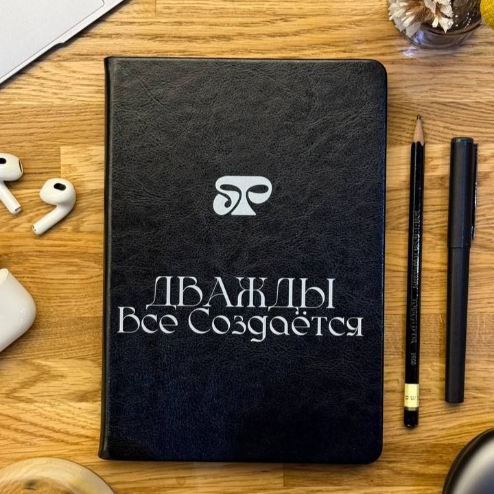
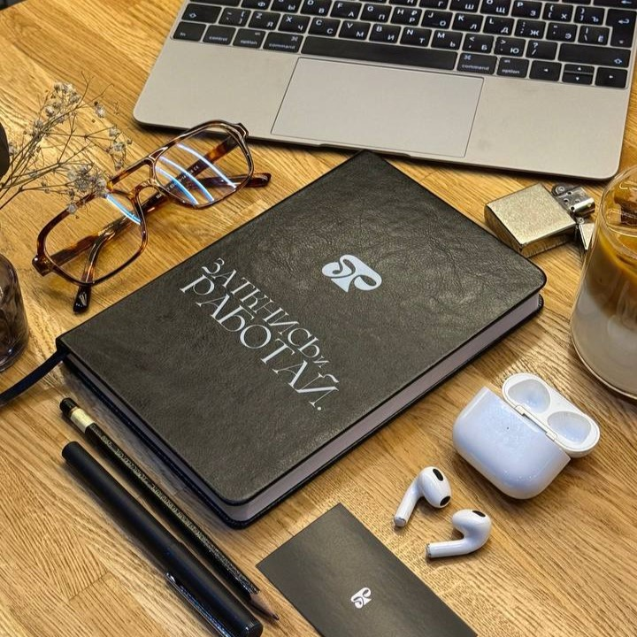
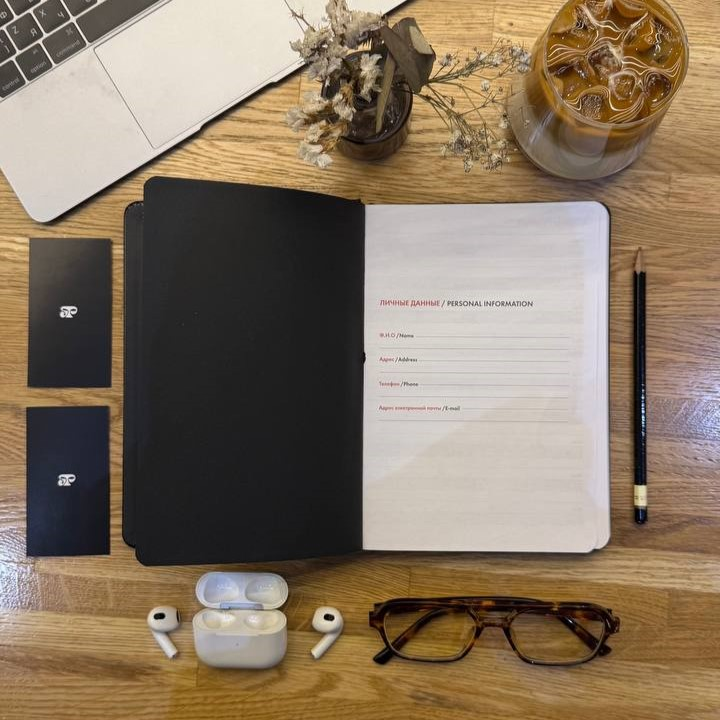

# Планирование.

## **Берёшь и покупаешь себе ежедневник.**

Да, именно так. _Не в телефоне, не в голове — а физический, бумажный ежедневник_. С этого начинается взрослый контроль над временем.

⚡️Ты должен знать, **как пройдёт твой завтрашний день**. Без иллюзий, без оправданий.

Вспомни, что такое **экономика**:

> _Рациональное использование ограниченных ресурсов для получения максимальной выгоды._

В твоём случае:\
— Ограниченный ресурс = **время и энергия**.\
— Максимальная выгода = **удовлетворение, продуктивность, рост, деньги**.\
— Рационально = **минимум усилий, максимум отдачи**.

Но главное — это дофаминовая система.\
🧠 Каждый выполненный пункт = **достигнутая цель**.\
Мозг привязывает выполнение задач к _чувству награды_, и с каждым днём ты будешь становиться **всё продуктивнее**. Ты начнёшь кайфовать от того, что идёшь по пунктам.

Если хочешь перейти от слов к делу — мой **ежедневник** тебе в этом поможет.\
Там всё, о чём мы говорим: фокус, цели, порядок, движение.\
📸 Смотри дальше — я прикрепил фото.

<figure><figcaption></figcaption></figure> <figure><figcaption></figcaption></figure> <figure><figcaption></figcaption></figure>

***

## **Как составлять план?**

_Показываю на личном примере:_

• 6:30 — Подъём, зарядка, душ\
• 7:00 — Завтрак, утренняя рутина\
• 7:30–12:00 — Работа с короткими перерывами (5–10 мин)\
• … и так далее на весь день

**Поначалу** расписывай день _в мельчайших деталях_. Чем подробнее — тем лучше.\
Позже можно будет сокращать.

***

## **Цветовая приоритизация:**

1. Один цвет — дела **первой важности** (на них строится день).
2. Второй цвет — **рутина**, которую ты обязан сделать (сон, еда, тренировка).
3. Важные задачи можно сопровождать «штрафом» — например:

> 16:15 — Чтение книги 10 минут
>
> _Не сделал → 50 отжиманий._

Таким образом ты формируешь **внутренний приоритет**, а мозг _сам начнёт фильтровать лишнее_.

***

## **Не забывай про календарь.**

📆 Цифровой или бумажный — выбирай сам. Главное, чтобы ты им **реально пользовался**.

Сначала внеси всю рутину: подъём, тренировка, завтрак, вечерняя гигиена и т.д.\
Потом — крупные занятия: учёба, работа, курсы, встречи.\
Останется свободное пространство — туда ты вписываешь всё, что требует гибкости: от чтения до созвонов.

📌 Упорядочивая календарь — ты **освобождаешь оперативную память мозга**. Ему не нужно держать в голове десятки напоминаний. Он просто _видит_ следующее действие и выполняет его.

***

**Недельное планирование — ключ.**\
Каждое воскресенье выдели **15 минут**, чтобы наметить план на неделю.\
Это даст баланс между краткосрочным (день) и долгосрочным (неделя, месяц) фокусом.
