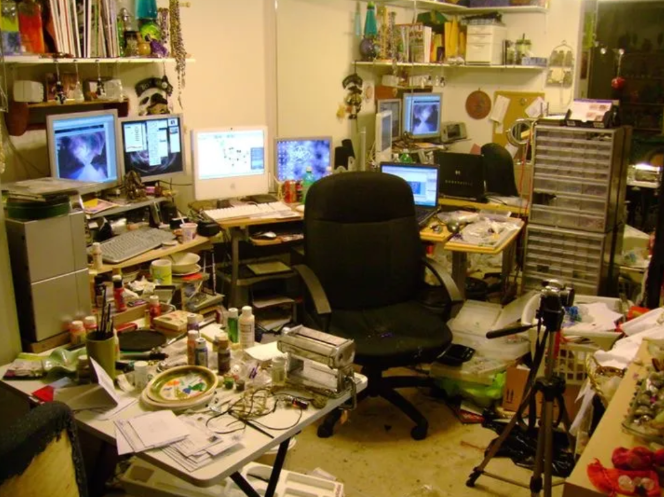
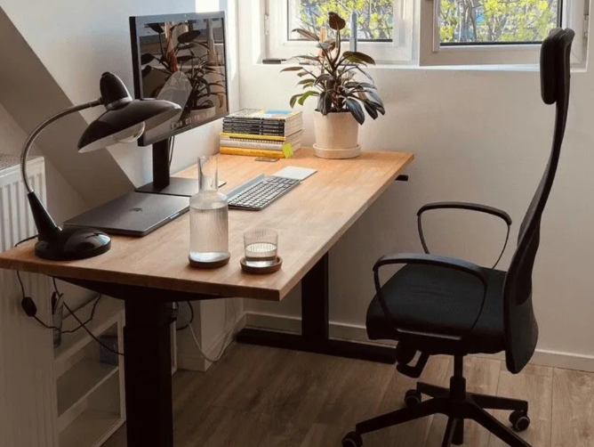
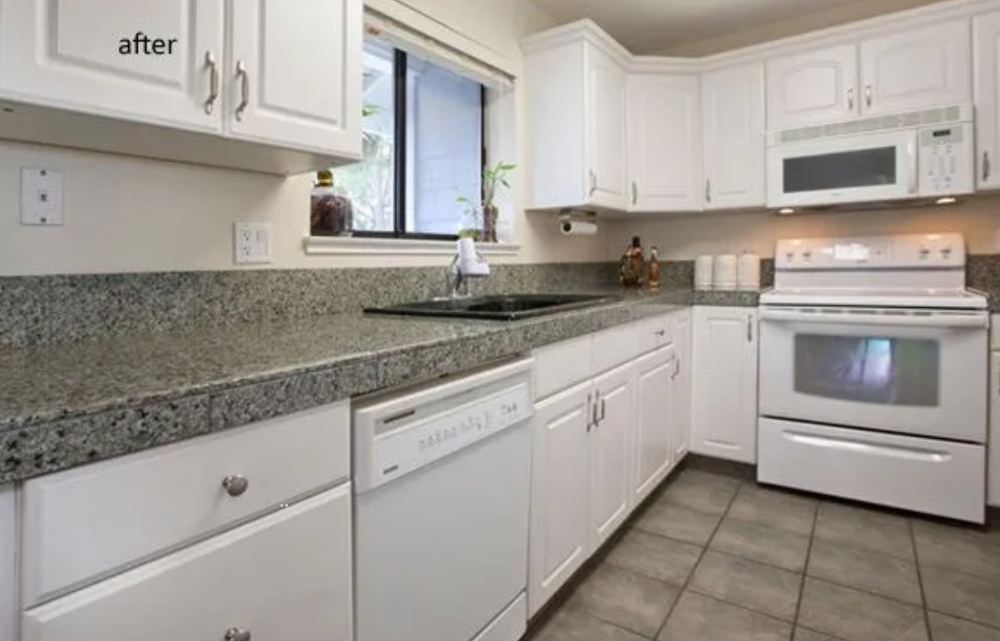
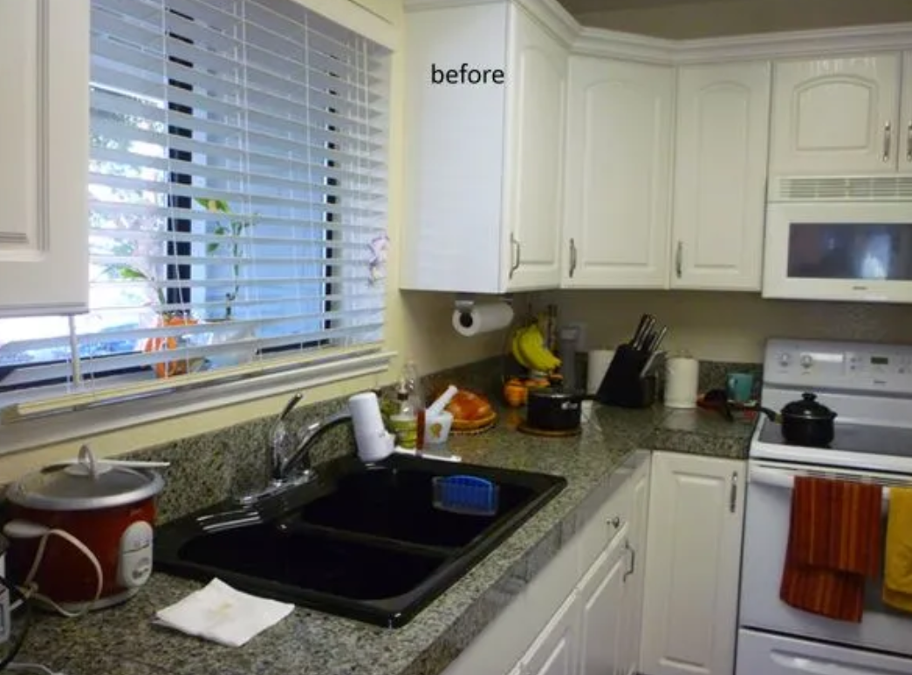
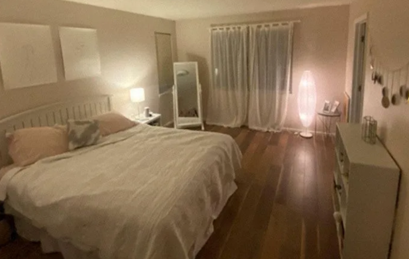
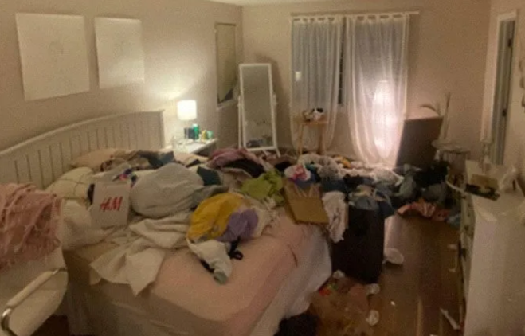
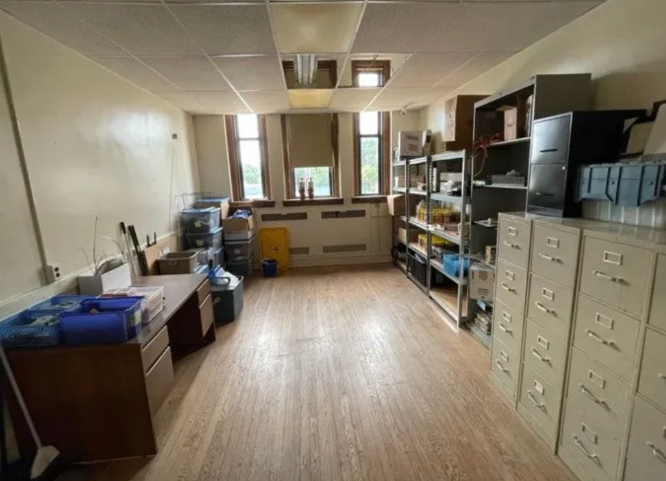
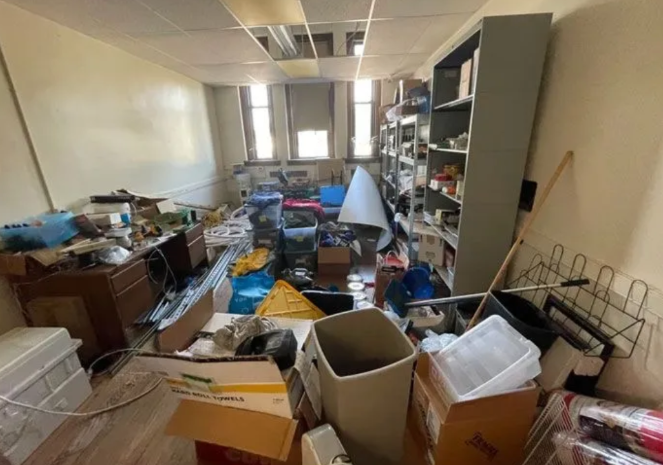

# Уборка.

***

## **Минимализм — не стиль. Это стратегия выживания.**

Ты должен понять: каждая вещь в твоём окружении — это якорь. Она цепляет твой взгляд, ворует внимание, грузит **лобные доли.** Даже если ты этого не осознаёшь, твой мозг **пытается дать ей применение**, держит её в фокусе, тратит энергию.

❌ У тебя слишком много вещей.\
И именно они воруют у тебя концентрацию, энергию, продуктивность.

## **Что делать?**

Берёшь мусорные пакеты. Настраиваешься. И начинаешь **изгонять весь хлам**. Без жалости. Даже то, что "может когда-нибудь пригодиться" — выбрасывай. Эти «может» — и есть твоя главная ловушка.\
Сделай это по-настоящему: комната за комнатой. Не в попыхах, а **с осознанием**, что ты освобождаешь место для роста, а не просто «чистишь квартиру».

👉 Вещи, которыми ты **не пользовался** в течение года, тебе не нужны.\
👉 Вещи, которые ты держишь ради _чужого_ впечатления, делают тебя слабее.\
👉 Вещи, которые заставляют тебя **«жалеть»**, держат тебя в прошлом.\
Фотографируй, если хочешь сохранить память — но **не сохраняй саму вещь**.

## Где тебе комфортней?

<figure><figcaption></figcaption></figure>

<figure><figcaption></figcaption></figure>

👉 Второе рабочее место гораздо лучше. И работать в такой обстановке **гораздо** приятней.

## ЕЩЁ ПРИМЕРЫ:

<figure><figcaption></figcaption></figure> <figure><figcaption></figcaption></figure> <figure><figcaption></figcaption></figure> <figure><figcaption></figcaption></figure> <figure><figcaption></figcaption></figure> <figure><figcaption></figcaption></figure>

**А теперь — несколько правил для генеральной зачистки:**

1. **Сверху вниз.**\
   Начинай с верхних полок и шкафов. Всё, что упадёт — упадёт вниз, и ты не будешь убираться дважды.
2. **Позови товарища.**\
   Если одному не хочется — зови брата, друга. Вместе и веселей, и эффективней.
3. **Выкидывай весь мелкий хлам.**\
   Мелочь, барахло, «на всякий случай» — _всё в мусор._ Не жалей. Свобода дороже.
4. **Не останавливайся на "вроде полезном".**\
   Если ты не используешь это — значит, это тебе не нужно. Освободи пространство.
5. **Шкаф — это не архив.**\
   Трусы, носки, футболки из 2008-го года — _всё вон._ Хочешь помочь — отдай нуждающимся. Хочешь радикально — выброси.
6. **Живи ради себя.**\
   Если предмет существует только для того, чтобы "показаться" — это не вещь, а петля. Избавляйся.
7. **Если жалко — сфотографируй.**\
   Так ты сохранишь "ценность", но отпустишь предмет. Это реально помогает.
8. **Избавься от "ящиков с запасом".**\
   Коробки, контейнеры, скрытые хранилища — главный источник мусора. Выбрось сам контейнер — и половина хлама исчезнет сама собой.
9. **Японская традиция — уборка как очищение.**\
   В Японии есть обычай под Новый год: тотальная уборка. Это не про чистоту — это про духовное обновление. В этом есть глубокий смысл.
10. **Чистые поверхности = чистое мышление.**\
    После уборки _не загружай обратно столы и полки_. Только самое нужное — ноутбук, зарядка, блокнот, ручка.

<figure><figcaption></figcaption></figure>

## И финальное: попрощайся с прежним собой.

👀 Держаться за вещи из прошлого - это то же самое, что цепляться за свой былой образ.


Закончим так: «вернуться к старому - это все равно что читать любимая книгу и ожидать, что случится _другой_ конец»

