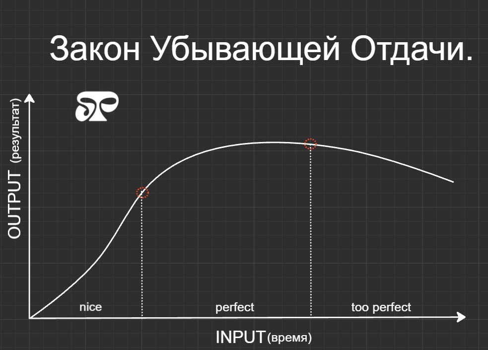
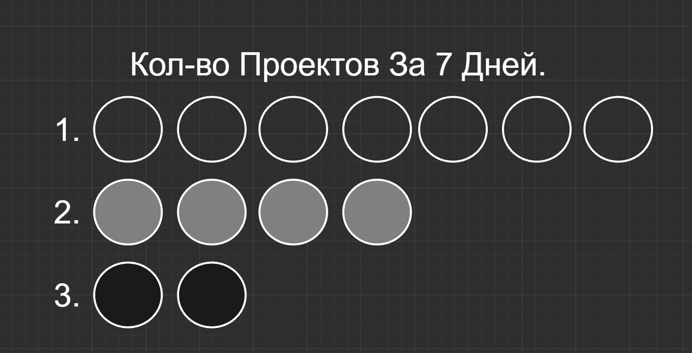
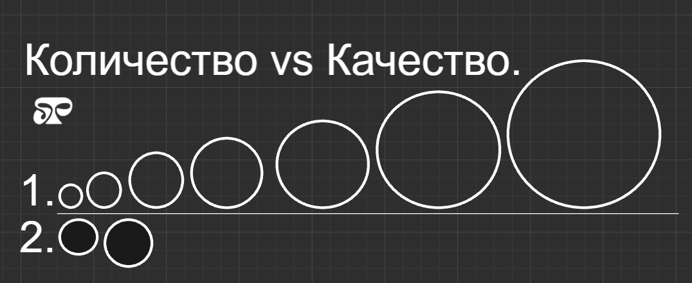

# Лучшее - враг хорошего.

Это не просто крылатая фраза, но и важное **напоминание** о том, как поиск идеала часто вредит самим результатам. Мы все хотим делать всё как можно лучше, веря, что это признак _высокого_ стандарта и силы характера.


Но на деле перфекционизм нередко мешает нам двигаться вперёд, отнимая время, силы и, что самое важное, возможности.


## Когда хорошее - это не просто достаточно, а почти всё.

Часто люди откладывают важные дела, потому что ждут **идеальных** условий или хотят проработать все нюансы до мелочей.

> **Возьмём пример:** человек хочет запустить проект, но не решается, пока не убедится, что всё просчитано до миллиметра. Он так увлекается планированием, что забывает о главном - действии.

В это время другие используют его идеи, выходят на рынок, получают первых клиентов и двигаются дальше. Пока человек гонится за идеалом, он теряет **возможность** использовать уже хорошие шансы и сделать шаг вперёд.

## Прокрастинация под маской перфекционизма.

Порой перфекционизм - это не что иное, как прокрастинация. Желание довести всё до совершенства нередко становится причиной того, что мы вообще не начинаем. Уверенность в том, что _**«либо всё идеально, либо никак»**_**,** превращает каждую задачу в груз и заставляет откладывать её до лучших времён, которых может и не быть.

В этом состоянии мы упускаем много возможностей: завершённые проекты, новые контакты, опыт. Когда человек фокусируется на каждом **недостатке**, он перестаёт видеть реальные шансы на успех, который, возможно, уже на расстоянии вытянутой руки.

## «Достаточно хорошо» - это тоже победа.

Пробуем **перевернуть** ситуацию: представим, что «достаточно хорошо» - это не упущенная возможность, а результат, который можно использовать здесь и сейчас. Написание статьи, выполнение проекта или презентация, где соблюдены **основные моменты и акценты,** - это уже шаг вперёд. Порой то, что уже сделано, даёт гораздо больше, чем долгие раздумья над тем, как сделать «идеально». В итоге мы теряем время и, главное, возможность учиться и _адаптироваться_ по ходу движения, ведь любой результат можно со временем улучшить, уже получив пользу от него.

## Как много мы теряем из-за стремления к идеалу?

Каждый раз, когда мы упускаем шанс **действовать** ради абстрактного идеала, возможности просто ускользают от нас.

> Время уходит, идеи устаревают, а люди, готовые сделать **«хорошо»,** вместо нас запускают проекты, пишут статьи, набирают клиентов и продвигаются по карьерной лестнице.

Мы же _остаёмся_ в состоянии бесконечного обдумывания. Получается, что выбор в пользу «достаточно хорошо» открывает двери к тем возможностям, которых у перфекционистов зачастую просто нет.

## Как найти баланс?

1. **Определяйте реальные цели.** Чёткое понимание задачи поможет не перегибать в деталях. Иногда лучше сделать основные акценты и двигаться дальше, чем тратить ресурсы _на **каждый** штрих._
2. **Замечайте прогресс.** Подмечайте, что уже сделано, а не зацикливайтесь на том, что могло бы быть лучше. Сколько вы уже "хороших" работ сделали, пока другие ни одной, зато **"отличной".**
3. **Работайте поэтапно.** Попробуйте выполнить задачу на хорошем уровне и улучшать её, если будет необходимость. Выходите с первой версией, а потом, когда есть **возможность**, делайте обновления.
4. **Завершайте задачи.** Отложенный проект - это упущенные возможности, а завершённая работа - это результат, который приносит опыт, идеи и шансы на **развитие**. Пусть даже у Вас не получится, зато - это опыт!

Просто начните, не думая об идеальном результате. Через год эта возможность уже будет реализована другими людьми. У них получится, они сделают денег, а вы так и просидите с "идеальной", но запоздалой или вообще нереализованной идеей.

## Проблема: Перфекционизм и прокрастинация.

Перфекционизм проявляется в трёх стадиях:

* До начала задачи: Страх **"испортить"** чистый лист чем-то менее идеальным.
* Во время выполнения задачи: Разочарование от того, что работа выглядит **несовершенной**, что заставляет бросать проект на полпути.
* После завершения задачи: **Зацикленность** на недостатках, как если бы пятно на белой рубашке перекрывало весь её внешний вид, что мешает получить удовольствие от результата.

_Эмоциональная основа перфекционизма — это стыд, заниженная самооценка и желание избежать критики или осуждения._

## Правило 70%.

Правило 70% меняет мышление с **"Мне нужно сделать это идеально"** на _"Мне нужно сделать это достаточно хорошо"_. Такой подход побуждает действовать, а не откладывать дела.

**Как это работает:**

1. **Ставьте цель в 70%:** Вместо стремления к идеалу, достаточно достичь "достаточно хорошего" результата.
2. **Вознаграждайте себя:** Каждый раз, когда достигаете 70%, признавайте этот успех и цените свои усилия!
3. **Прерывайте негативные мысли:** Задавайте себе вопрос: "Это было лучше, чем 70%?" Если да, значит, это уже _достаточно_ хорошо.

**Пример:**

* При создании видео вместо вопроса **"Могу ли я сделать это видео идеальным?"** я задаю себе вопрос "Могу ли я сделать это видео на 70% хорошим?". Ответ, как правило, будет "да", что снижает внутреннее сопротивление к началу работы.
* При отказе от вредных привычек (например, алкоголя) вместо попытки добиться **"идеальной серии из 30 дней трезвости"** оценивайте, сколько дней в месяце вы оставались трезвыми, и стремитесь, чтобы это было не менее 70% времени.

## Почему это работает.

Правило 70% работает по четырём ключевым причинам:

1. **Снижает порог для начала:** Проще начать, когда идеальность не обязательна.
2. **Соответствует закону убывающей отдачи:** После достижения 70% дополнительные усилия приносят меньше результата, поэтому стремление к 100% становится _неэффективным_.
3. **Способствует завершению проектов:** Работа ценна только тогда, когда она завершена. Если цель — достичь 70%, проект с большей _вероятностью_ будет доведён до конца.
4. **Создаёт более здоровую систему убеждений:** Отделяет _самооценку_ от качества выполненной работы. Со временем вы осознаете, что создание чего-то несовершенного не приводит к осуждению или отвержению.

<figure><figcaption>
Закон Убывающей Отдачи.
</figcaption></figure>

На этом простом графике приведено, как перфекционизм влияет на качество результата. Первый квадрант - это и есть 70%. **Отличная работа.**

Второй квадрант - это уже больше 70%. Заметьте, что мы тратим столько же или больше времени ради того, чтобы улучшить результат на несколько процентов. **Я не говорю, что это плохо,** но позже расскажу, почему не считаю это рациональным.

**Третий квадрант - Слишком хорошо.** Это пример перфекционизма "После завершения задачи". Зачастую он бывает губителен - на него тратится большое количество времени, ухудшается объект, не развивается субъект, пропадает удовольствие от объекта.

**Для примера, возьмём 3 Ютубера.** Каждый из них - один вид из схемы выше. Они каждый делают свою работу по-разному.

<figure><figcaption>
Количество проектов за 7 дней.
</figcaption></figure>

1. Первый сделает 7 видео по качеству на уровне **70%.**
2. Второй сделает 4 видео на уровне **90%.**
3. Третий сделает только 2 видео, но по качеству **на все 96%.**

<figure><figcaption>
Количество против Качества.
</figcaption></figure>

_На этой иллюстрации изображен рост опыта у двоих Ютуберов._

Каждый раз, когда вы берётесь за проект и доводите его до конца, вы становитесь **лучше в создании новых проектов.** Это благодаря обратной связи от людей, которые оценивают вашу работу, и от вас самих, как человека, завершающего начатое. Поэтому у того, кто за неделю сделал семь проектов, потенциал на самом деле растёт. И тут становится ясно: 70% от большого **"пирога"** гораздо лучше, чем 95% от просто "нормального"

Количество побеждает качество: Это похоже на исследование **фотокласса**, в котором ученики, создававшие больше фотографий, делали лучшие снимки по сравнению с теми, кто пытался сделать всего одну "идеальную" фотографию.

**❗ После достижения 70% можно**, при желании, доработать до 85% или 90%, но не стоит застревать на этом этапе.

Ваше "70%" может быть разным — возможно, это 50% или 80%, но суть в том, чтобы найти тот уровень, который снижает сопротивление и _помогает завершать задачи._

#### Энн Ламотт:

> «Перфекционизм основан на навязчивой вере, что если вы будете двигаться достаточно осторожно, наступая на каждый камень, то избежите смерти. Правда в том, что вы всё равно умрёте, и множество людей, которые даже не смотрят под ноги, добьются большего и будут получать гораздо больше удовольствия от жизни.»

**Эта цитата подчеркивает, что погоня за совершенством** — это бесполезная и даже вредная стратегия. Правило 70% предлагает способ жить, работать и творить более свободно и радостно.
